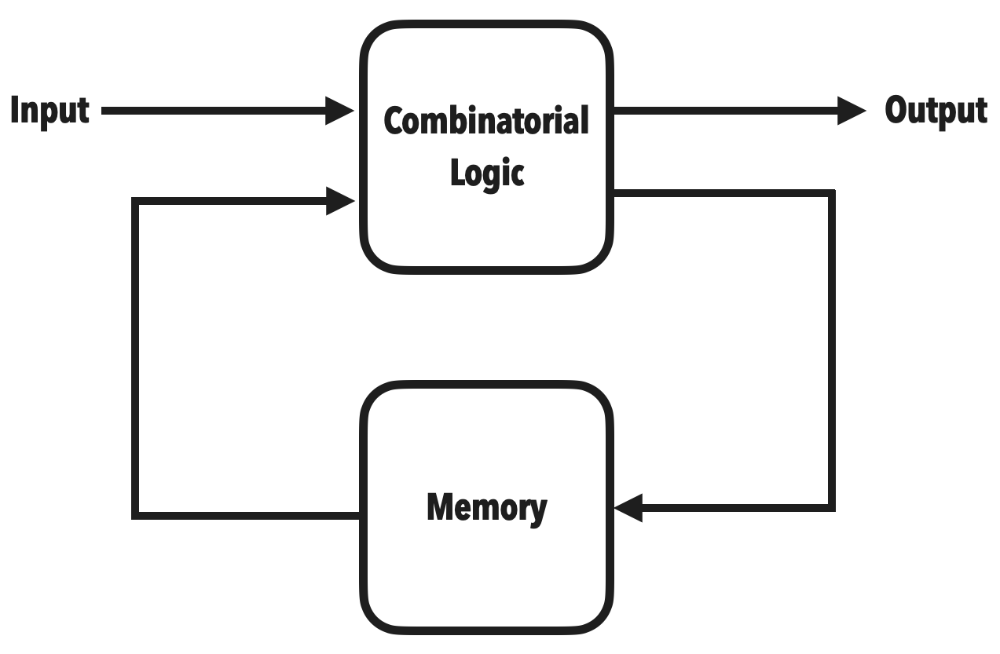
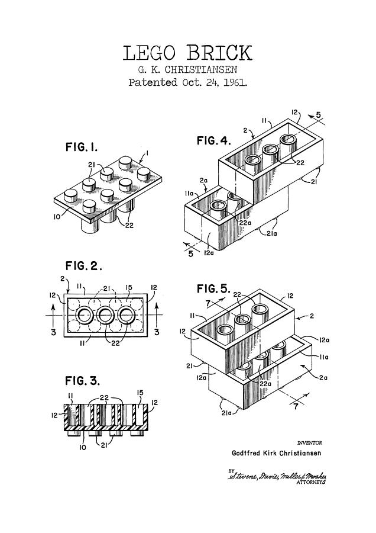

# State Machine

> AI + State Machine = Autonomous AI State Machine

## Importance of Memory




A pure AI engine with no native memory is simply the **input => combinatorial => output** part of the diagram above.

To build a truly autonomous intelligence, simply having an AI engine isn't enough. It needs **a brain that can, not only process, but also remember.**

It needs a brain that has a native memory.


## Bottom up architecture

In order to seamlessly emulate an organic brain, an architecture that adopts multiple heterogeneous modules loosely connected with one another as an afterthought, is less than ideal because it creates system integration complexities, and is not flexible enough to build complex emergent life forms.

The ideal architecture would be **a single unified low level primitive that can be composed to build various higher level modules**, each of which does completely different things.



Pinokio achieves this by using a single low level primitive:

1. **Files** for storing everything
2. **JSON** for expessing everything (data, code, schema, API, etc.)

More specifically,

1. code can be expressed as data
2. data exists seamlessly together with code
3. Everything has the same interface (like lego blocks, or neurons), which makes it poossible for the low level primitives to elegantly interact with one another.


## Code as Data

It's important to understand that Pinokio lets you express not just data, but also code (in JSON-RPC format) in JSON. Here's an example that writes text to a file:


```json
{
  "run": [{
    "method": "fs.write",
    "params": {
      "path": "loremipsum.txt",
      "text": "Lorem ipsum dolor sit amet, consectetur adipiscing elit. Praesent id tellus sapien"
    }
  }]
}
```

Furthermore, the RPC declarations can dynamically construct themselvees through the use of template expressions. For example, here's a code snippet that runs a StableDiffusion txt2img request, converts the base64 encoded image to a Buffer object, and saves the dynamically generated image buffer to a file:


```json
{
  "run": [{
    "uri": "https://github.com/cocktailpeanut/automatic1111.git/index.js",
    "method": "run",
    "params": {
      "cfg_scale": 7,
      "steps": 30,
      "prompt": "a pencil drawing of a dog"
    }
  }, {
    "method": "fs.write",
    "params": {
      "path": "img.png",
      "buffer": "{{Buffer.from(input.images[0], "base64")}}"
    }
  }]
}
```

There is a lot of power in being able to express the code in JSON:

1. **Store:** Many database systems nowadays support JSON storage and indexing right out of the box. You can query and filter code.
2. **Mutate:** Structuring function calls in a JSON format makes it easily mutable. Instead of having to string match and replace, you can simply update some attribute in the RPC call object.
2. **Transmit:** JSON is the 1st class citizen of the world wide web. You can send and receive Pinokio script code over various internet protocols (such as HTTP), which results in various other important properties such as breedability and evolvability. 

## Data as Code

Furthermore, it is possible to seamlessly integrate data into the code as a part of the JSON tree. 

Pinokio always lets you reference the currently executing JSON with a variable named `self`. Taking advantage of this property, we can convert the code from the last section into the following:


```json
{
  "prompt": "a pencil drawing of a dog",  <= extracted out hardcoded data out to its own attribute
  "run": [{
    "uri": "https://github.com/cocktailpeanut/automatic1111.git/index.js",
    "method": "run",
    "params": {
      "cfg_scale": 7,
      "steps": 30,
      "prompt": "{{self.prompt}}"         <= Using a template expression now
    }
  }, {
    "method": "fs.write",
    "params": {
      "path": "img.png",
      "buffer": "{{Buffer.from(input.images[0], "base64")}}"
    }
  }]
}
```

## Unified Interface

1. [Everything is a file](../fs/overview#everything-is-a-file): Everything in Pinokio exists as a file. There is no complex protocol you need to follow, as making modules interact with each other is as simple as reading and writing files.
2. [Everything is expressed as JSON](../fs/overview#json-protocol): Everything is expressed in JSON, from data to code, to everything else. The JSON structure acts as the unified interface that makes it trivial to **extend logic**, **extend data**, **communicate among modules**, and more.

## Process + Remember

For something to be autonomous, it is not sufficient to be able to "process", but also "remember" and "learn" (which in turn is possible only when it can "remember").

By taking advantage of APIs such as `fs.write`, `set`, `rm`, etc., a Pinokio script is able to:

1. update its own algorithm
2. update its memory

in realtime.
