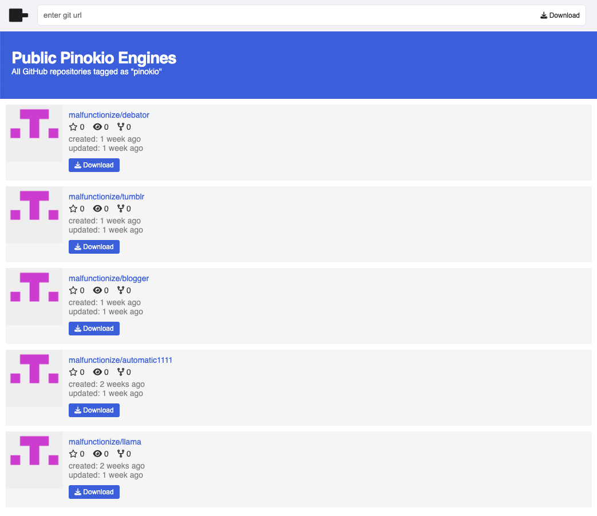
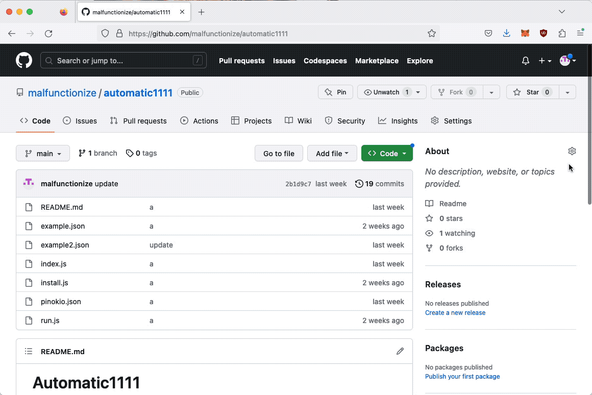

# Publishing the API

Now that we know the API is working correctly, we want to share it with the world, so anyone can download and use our APIs.

There are a couple of things to note:

1. **Include an Example:** Package an example along with the API if possible. It's nice to be able to install an API and immediately try it out. You can set up a separate example repository, or include it in the same API folder.
2. **Switch examples to use the HTTP URI:** We've been using the relative path as the URI. But when publishing, we need to change the examples to use the public HTTP paths as URIs. For example, if I'm going to publish my `utils` API to `https://github.com/cocktailpeanut/utils.git`, I may want to go back and change all the examples to use the `"uri": "https://github.com/cocktailpeanut/utils.git/index.js"` instead of `utils/index.js` (Remember, people may download the repository to whichever folder name THEY want, so the relative path approach won't work anymore when you publish.)
3. **Publish to GitHub:** Publish to GitHub. You can publish to other git hosting services as well, but GitHub recommended for now [for discoverability](#list-on-pinokio).
4. **List:** When publishing to GitHub, tag your repository with `pinokio`, and it will automatically show up inside the Discover page in the Pinokio app.


## Include a README

Just like how GitHub automatically renders README.md files for any git repository, Pinokio also renders the `README.md` files. All you need to do is include the file in the root folder of your API repository.

a README documentation helps users easily use your API, so be as descriptive as possible.

## Include some examples

Also, it's great to include some example scripts, so the users who download your API can try out the API instantly without them having to write their own script to test.

For example,

1. just create an `example` folder and include the example scripts under the folder
2. link to the example scripts from `README.md`

Or if you want just a simple script, you can just create one `example.json` in the root folder. Choice is up to you.

## Examples must use HTTP URIs

One thing to remember when publishing APIs, is that once you publish, you shouldn't expect people to use the API by using the relative path you used while developing the API.

For example, you may have created a folder named `~/pinokio/api/utils`, but once you publish, another user may download it under `~/pinokio/api/utilities`, which means you can no longer assume that the `"uri"` will be `"utils"`.

From the moment you publish your repository, you can start using the public git URL, which means, if you've included some example scripts in your API repository, you should switch out all the relative paths to the public git URL. For example:

```json
{
  "run": [{
    "uri": "utils/index.js",
    "method": "random",
    "params": {
      "items": ["apple", "banana", "orange", "grape", "kiwi"];
    }
  }]
}
```

may become:


```json
{
  "run": [{
    "uri": "https://github.com/cocktailpeanut/utils.git/index.js",
    "method": "random",
    "params": {
      "items": ["apple", "banana", "orange", "grape", "kiwi"];
    }
  }]
}
```

> NOTE
> 
> The public git url MUST end with `.git`. This is the standardized way to reference git repositories.


## Publish to GitHub

Finally we're ready to publish.

There's nothing special here, just publish the repository to GitHub just like you publish any repository.

## List on Pinokio



Pinokio has a "discover" page which displays all the public Pinokio APIs published on GitHub.

To list your published API on the Pinokio discover page, just tag your repository with "pinokio", and it should immediately show up on the discover page:



