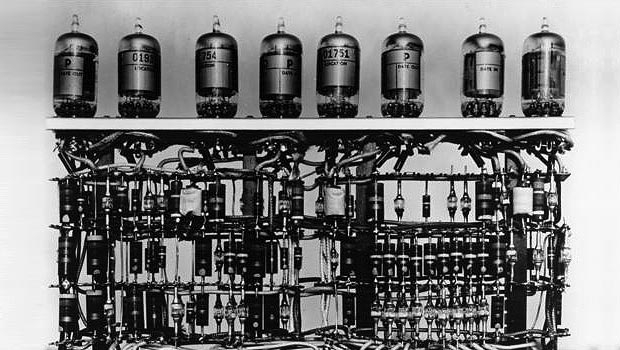

# Memory

As a pinokio script gets executed step by step, you can update the memory so it can be used in later steps.

1. [Input](input): (readonly) The value passed in from the previous step in the script.
2. [Local variable](local): (read and write) An in-memory variable that gets reset every time a Pinokio script finishes running. Sandboxed to the current script namespace.
3. [Global variable](global): (read and write) An in-memory variable that persists as long as Pinokio is running. When you restart Pinokio, it gets wiped out. To reset a global variable without restarting Pinokio, you can use the [rm](../api/datastructure#global-variable-1) API to reset the value.
4. [Self](self): (read and write) Variables that are accessible from memory, but also persisted to the file system. Will NOT be reset even when Pinokio restarts, since everything is stored in a file.
