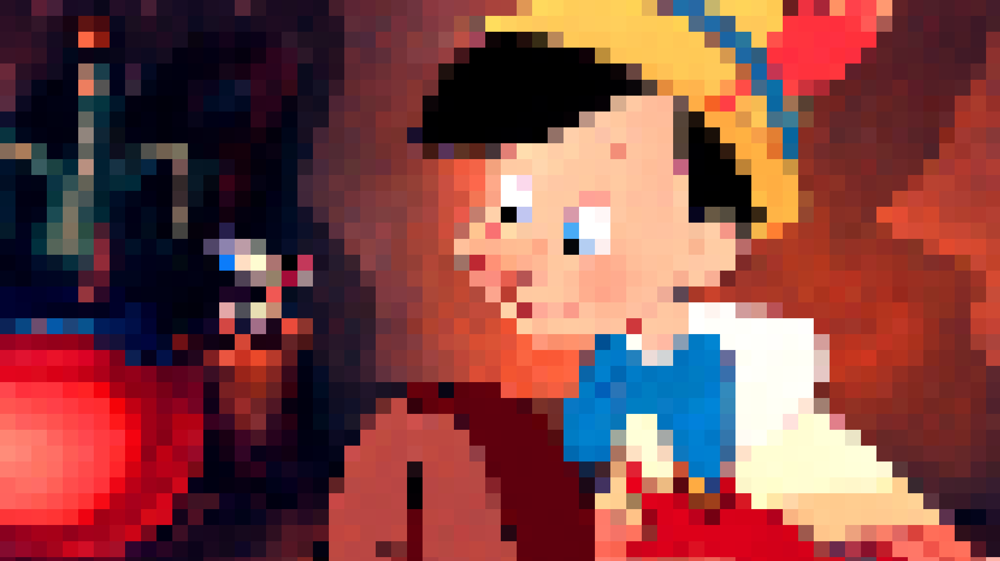
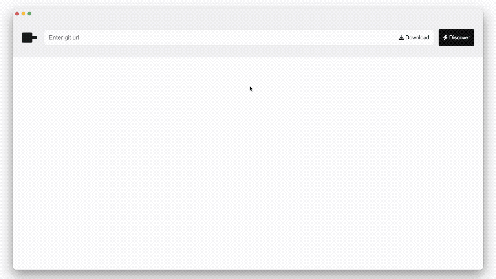
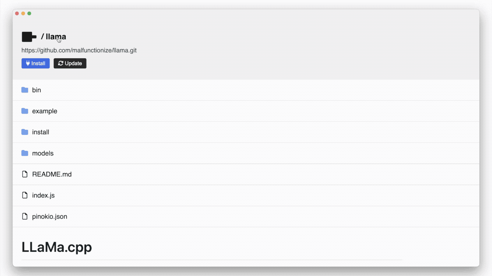

# Pinokio

<b>A Living Application</b>

## A Living Application

**Pinokio is an application that lives.**

Unlike traditional applications that have a static form, Pinokio can run anything, capture anything, and grow and evolve.

### Can run anything

Pinokio is an application that can autonomously read, write, process, and execute anything on your computer, with a simple scripting language. Pinokio can:

- compose files
- download files
- accumulate data
- install libraries and other applications
- run shell commands
- make network requests
- publish files
- browse the internet
- and **pretty much anything a human can do on a computer, without requiring humans.**

Here's an example where Pinokio automatically creates a project, installs libraries, writes a server for a web server, and starts the server, 100% automated:

### Can install and control AI

With the ultimate automation capabilities, Pinokio can even automatically install and run various AI engines and models on the fly, and use them to make decisions and execute tasks.

- llama.cpp
- stablediffusion
- etc.

### Can remember and evolve

Pinokio has a [100% self-contained architecture](fs/overview#everything-is-a-file), which makes the intelligence portable and shareable, which also means it can grow and evolve.

## Features

### Browse and Install

Browse and install anything, including AI engines (llama, stablediffusion, etc.) **with one click**.

### Run

Automate anything through script.

### Automate

Mix and match multiple scripts to execute complex tasks.

### Share

Instantly share the workflows, scripts, datasets, and everything over git.

[Everything in Pinokio is a file](fs/overview.html), therefore ultra-shareable.

## How it works

Pinokio is a virtual computer.

It has all the components of a traditional computer, except every component is written from scratch to facilitate the main goal, which is to build the ultimate application that can live.

### Architecture

1. **[File System](fs/overview):** Where and how Pinokio stores files.
2. **[Processor](processor/overview):** How Pinokio runs tasks.
2. **[Memory](memory/overview):** How Pinokio implements a state machine using its built-in native memory.
4. **[API](api/overview):** Core APIs shipped with Pinokio.
5. **[Lifeform](ai/overview):** How to build a fully autonomous application that evolves on its own.

