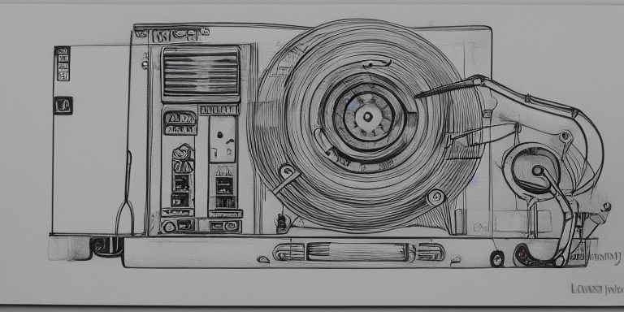

# Overview

The processor is the CPU of Pinokio. It follows the same scheme all modern CPUs implement ([fetch-decode-execute cycle](https://en.wikipedia.org/wiki/Instruction_cycle#Summary_of_stages))

> You can think of Pinokio as an **autonomous state machine** that loads its updated state in realtime and executes commands based on its most recent state, for every step.

1. **[Fetch (Loader)](fetch):** The loader engine instantiates the state machine (including the memory as well as `self`, which refers to its own code)
2. **[Decode (Template)](decode):** The template engine takes a template expression and instantiates it using the current state provided by the loader
3. **[Execute (Runner)](execute):** The runner takes the instantiated request and executes it.

