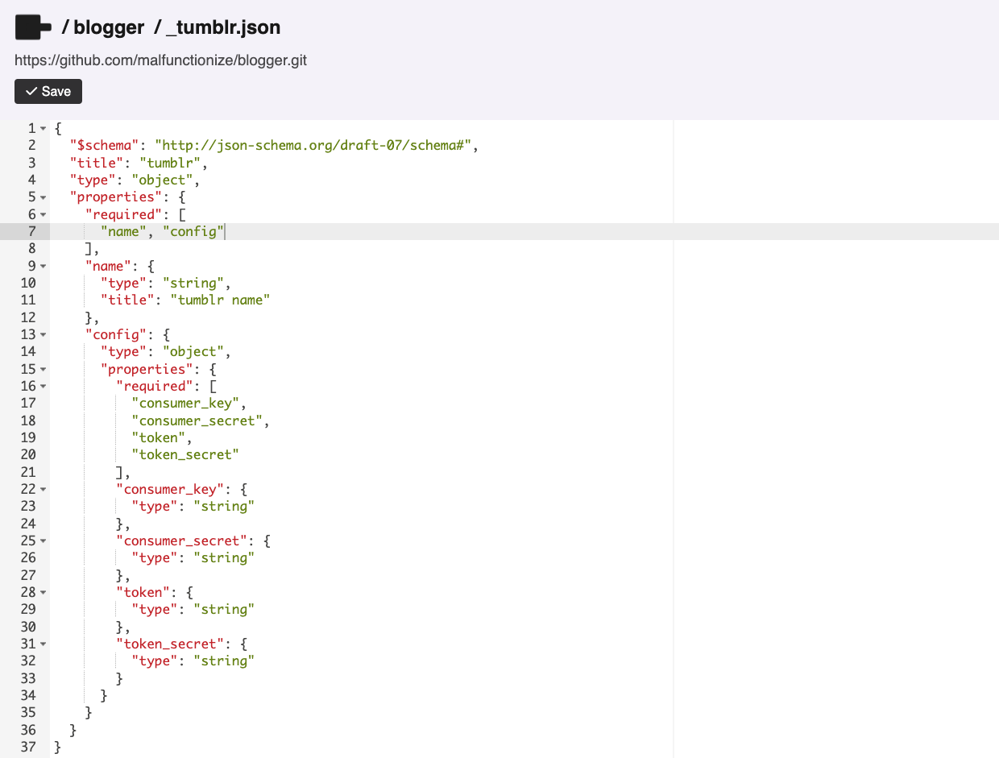
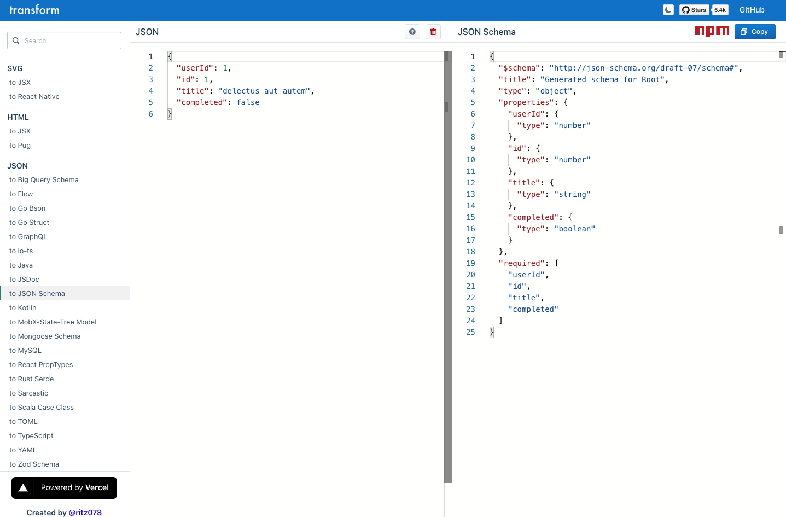

# Form

Everything in Pinokio is JSON.

You can configure everything by simply opening the JSON files, updating, and saving:


But sometimes you may want to provide an easy-to-use UI for end users, so they can play with data easily **without having to directly tweak the JSON files**. Here's an example:


## How to generate a form

Pinokio provides an easy way to automatically generate forms like this for any JSON file. You can achieve this using the built-in form builder engine. Here's how it works:

1. Pick a JSON you want to generate a form for.
2. Create a JSON schema for the JSON.
3. Save the schema with a filename expected by Pinokio (Just add a `_` prefix to the original filename)
4. Now when you open the original JSON file, it will display the form view instead of the raw JSON.

For example, we havea `tumblr.json` file that we want to turn into a form:


We can do this by simply creating a file named `_tumblr.json` (note the `_` prefix) in the same folder and saving the JSON schema for the `tumblr.json` file:



Now when we visit the `tumblr.json` file, instead of the raw JSON view, we get the form view:


You can click the **View Source** button to switch to the JSON view.

## Getting a JSON schema



You can easily create a JSON schema from any JSON.

For example you can just use web apps like https://transform.tools/json-to-json-schema to enter any JSON and it will automatically generate a basic schema for you.

You can customize further on top of the basic schema if you want.

## Examples

### Case Study: Data Forms

Let's say we have an array stored at `animals.json`:

```json
[
  "Aardvark",
  "Ant",
  "Antelope"
]
```

And we want people to be able to edit this list WITHOUT touching the raw JSON, but through a form.

Just create a JSON schema file for `animals.json`, named `_animals.json`, in the same folder:

```json
{
  "$schema": "http://json-schema.org/draft-07/schema#",
  "title": "animals",
  "type": "array",
  "items": {
    "type": "string",
    "title": "animal"
  }
}
```

Now when you open the `animals.json`, it will display the form view by default.

### Case Study: Config Forms

Another useful case is when you need to configure some engines, such as API clients.

Instead of making users manually edit JSON, you can auto-generate a form to set all the configuration fields.

Let's say we have built a tumblr API client script, and it requires the `tumblr.json` to be filled out before using:

```json
{
  "name": "",
  "config": {
    "consumer_key": "",
    "consumer_secret": "",
    "token": "",
    "token_secret": ""
  }
}
```

We can create a JSON schema file for `tumblr.json`, which will look like this:


```json
{
  "$schema": "http://json-schema.org/draft-07/schema#",
  "title": "tumblr",
  "type": "object",
  "properties": {
    "required": [
      "name", "config"
    ],
    "name": {
      "type": "string",
      "title": "tumblr name"
    },
    "config": {
      "type": "object",
      "properties": {
        "required": [
          "consumer_key",
          "consumer_secret",
          "token",
          "token_secret"
        ],
        "consumer_key": {
          "type": "string"
        },
        "consumer_secret": {
          "type": "string"
        },
        "token": {
          "type": "string"
        },
        "token_secret": {
          "type": "string"
        }
      }
    }
  }
}
```

And now when the users open `tumblr.json`, they will get the form view, which is much easier to work with.

