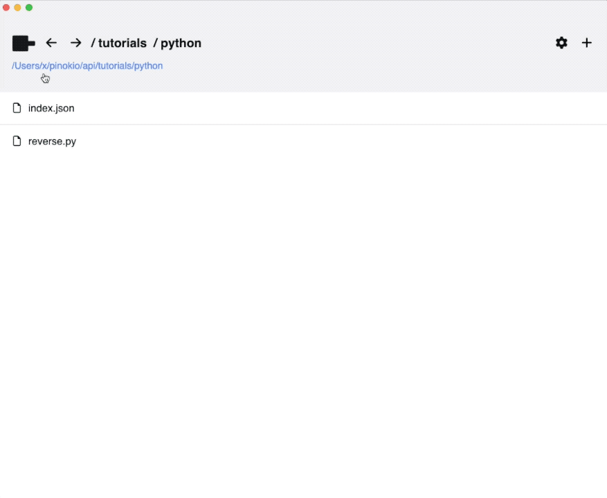

# Running python scripts

Let's zoom out and think about what all this means:

1. You can pretty much control ANYTHING on your computer with terminal.
2. You can control COMPLETELY control terminal with Pinokio shell.
3. This means you can control anything on your computer with pinokio.

To emphasize this concept, let's write a simple python script, which then can be controlled with Pinokio script.

1. We will write a python script that takes a string as an argument, and prints a reversed version of it on the terminal.
2. Then we will run this python script using Pinokio script.



First create a python file named `reverse.py`:

```python
import sys
def reverse(input_string):
    return input_string[::-1]
print("<pinokio>" + reverse(sys.argv[1]) + "</pinokio>")
```

This program takes a command line argument, reverses the string, and returns the value wrapped with `<pinokio> ... </pinokio>` (Just so it's easier to process the pattern from the Pinokio side.

Now let's write a Pinokio script that runs this python script. Create a file named `run.json` in the same folder:


```json
{
  "run": [{
    "method": "shell.start"
  }, {
    "method": "shell.enter",
    "params": {
      "message": "python reverse.py helloworld",
      "on": [{
        "event": "/<pinokio>(.+?)<\/pinokio>/",
        "return": "{{event.matches[0][1]}}"
      }]
    }
  }, {
    "method": "notify",
    "params": {
      "html": "{{input}}"
    }
  }]
}
```

1. It creates a shell session (`shell.start`)
2. Runs the `python reverse.py helloworld` command (`shell.enter`)
3. Waits for the `/<pinokio>(.+?)</pinokio>/` regular expression event
4. When it does, it parses the matched part and returns it (`event.matches[0][1]` is the first item in the capture group from the first match)
5. Then we call the `notify` method to display a push notification with the reversed string `{{input}}`


